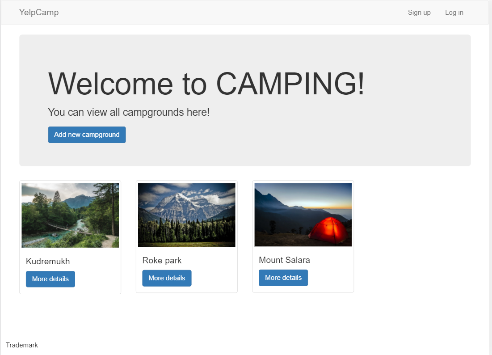
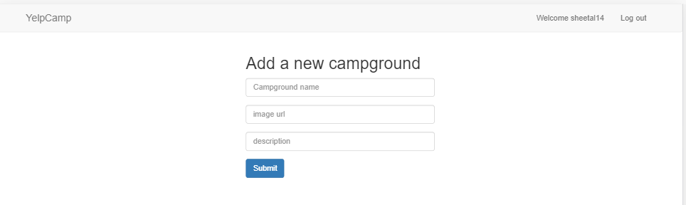

## Project description
This is a responsive website that allows users to view different campsites. Once logged in, the users can add comments on campsites, add new ones and delete or edit their comments / posts.
It is built using NodeJS Express framework, MongoDB and ejs (emebedded Javascript templates)

## Project Preview
https://still-dusk-92172.herokuapp.com/

## Avg time duration
2 months

## Snapshots

### Main page

### Single Campground

### New Campground page

